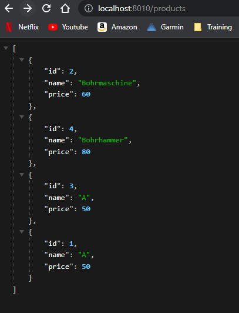
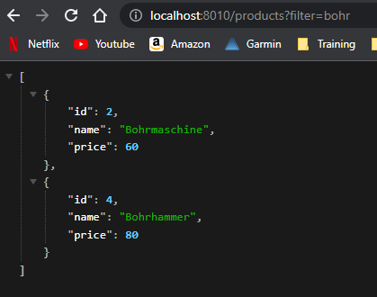

# Microservice in Go

[Link to Github Repo](https://github.com/awenzelhuemer/fh-mc-go-mux)

## Progress during development

1. Installed compiler and vs code extensions https://go.dev/
2. Created docker-compose.yml for postgres

```yml
version: '3.8'
services:
  postgres:
    image: postgres:14.1-alpine
    restart: always
    environment:
      - POSTGRES_USER=${POSTGRES_USER}
      - POSTGRES_PASSWORD=${POSTGRES_PASSWORD}
    ports:
      - '5432:5432'
    volumes: 
      - postgres:/var/lib/postgresql/data
volumes:
  postgres:
    driver: local
```

3. After that I followed the instructions which worked well so far except of a few problems.
4. The import `var a main.App` does not seem to work in the *main_test.go* file and had to be changed to `var a App`.
5. Additionally the server stopped immediately after starting it with `go run main.go` and I had to add following in the `main.go` file:

```go
http.Handle("/", a.Router)
http.ListenAndServe(":8010", nil)
```

## Added features

1. Added filter functionality to the */products* endpoint

```go
func getProducts(db *sql.DB, start, count int, filter string) ([]product, error) {

	// prepare filter
	if filter != "" {
		filter = strings.ToLower(filter) + "%"
	}

	rows, err := db.Query(
		"SELECT id, name,  price FROM products WHERE ($1 = '' OR LOWER(name) like $1) LIMIT $2 OFFSET $3",
		filter, count, start)

	if err != nil {
		return nil, err
	}
```





2. Added PATCH functionality:

With update always the whole entity has to be sent to the server. With PATCH only the properties which should be updated have to be sent.

```go
func (a *App) patchProduct(w http.ResponseWriter, r *http.Request) {
	// ... load product

    // set properties from request body
	if updated.Name != "" {
		p.Name = updated.Name
	}
	if updated.Price != 0.0 {
		p.Price = updated.Price
	}

    // update single values of product
	if err := p.updateProduct(a.DB); err != nil {
		respondWithError(w, http.StatusInternalServerError, err.Error())
		return
	}

	respondWithJSON(w, http.StatusOK, p)
}

func (a *App) initializeRoutes() {
	a.Router.HandleFunc("/product/{id:[0-9]+}", a.patchProduct).Methods("PATCH")
}
```